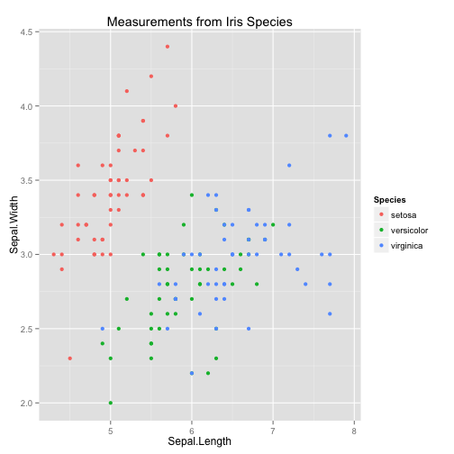

Data Examination App
========================================================
author: Linda Kukolich
date: September 25, 2015

Data Exploration
========================================================
This application allows users to explore two data sets through interactive plots.

- Two sets of generated Gaussian data, with user specified means and variances
- A classic classification data set using measurements of parts of the flower to distinguish between different species of Irises

Generated Gaussians
========================================================

- Many data analysis algorithms are based on models assuming that the data have a Gaussian distribution.

- Explore two Gaussians by setting their means and variances.

Gaussian Plots
===

 

***

 

Iris data
========================================================

This famous (Fisher's or Anderson's) iris data set gives the measurements in centimeters of the variables sepal length and width and petal length and width, respectively, for 50 flowers from each of 3 species of iris. The species are Iris setosa, versicolor, and virginica. The sepals are the leaf-like outer parts of a flower that enclose the bud while it develops.

Explore the Iris data by selecting which variables to plot.

Iris Plots
========================================================
 

Sepal Length versus Sepal Width

***

 

Petal Width versus Sepal Width

